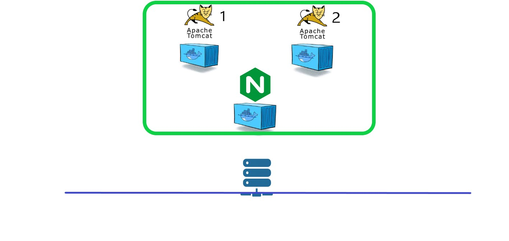
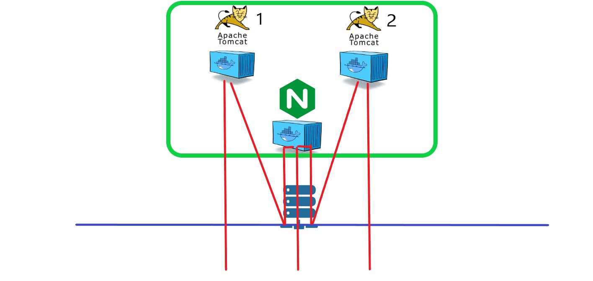
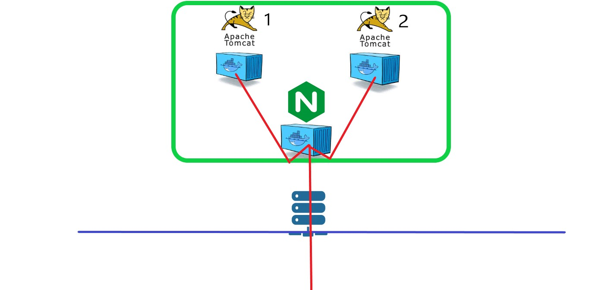

# nginx_reverse_proxy_basic

basic form of reverse proxy using nginx, on Docker

load balancing option

참조 : http://nginx.org/en/docs/stream/ngx_stream_upstream_module.html

ip_hash - ip로 분배한다. 만약 A라는 ip가 server1에 접속했으면 이후에도 server1에 계속 접속하게 되며, 한번 접속한 ip는 계속 같은 서버를 사용한다.

least_conn - 가중치를 고려하면서 연결된 접속자가 가장 적은 서버로 분배

least_time - 연결된 접속자가 가장 적으면서 + 평균 응답시간이 가장 적은 쪽으로 분배

위와 같이 container 3 개를 설정해 실습했다.

basic 1

- nginx 프록시 서버 1개, tomcat 1, tomcat 2.
- 프록시 서버 포트 매핑
  - 80:80 -> load balancing (gateway:10001 , 10002)
  - 1111:8080, 9999:8081 -> reverse proxy (8080->gateway:10001 , 8081->gateway:10002)
- tomcat 서버 포트
  - tomcat 1 : 10001
  - tomcat 2 : 10002
- 특징

  - 프록시의 경로 : ip:portnum(프록시서버) => gateway:portnum(서버)
  - container에서 다른 container 로 proxy 를 진행하기 위해서 gateway 의 주소를 입력해야했음.(127.17.0.1)

    - compose 에 의해 자동으로 생성된 container network 의 gateway 주소를 입력하면 proxy가 동작하지 않았음. (왜인지는 모르겠음.)
    - 또한, 그렇다면 기본 bridge 네트워크에 포트가 열린 것으로 기록되어야 하는데, 생성된 container network 에 연결된 것으로 보임 (모순)
    - 정리 : 외부로 열린 포트임에도 불구하고 bridge network 정보에는 포함이 안되어있었다.

  - 외부 ip 였다면, 프록시 서버(80,1111,9999), tomcat서버(10001,10002) 의 포트가 모두 열리는 상황이므로 적합하지 않음.

basic 2

- nginx 프록시 서버 1개, tomcat 1, tomcat 2.
- 프록시 서버 포트 매핑
  - 80:80 -> load balancing (tomcat1, tomcat2)
  - 1111:8080, 9999:8081 -> reverse proxy (8080->tomcat1 , 8081->tomcat2)
- tomcat 서버 포트

  - 외부로 안열림

- 특징

  - 프록시의 경로 : continer으 ㅣ이름.
  - basic 1에서는 container에서 다른 container 로 proxy 를 진행하기 위해서 gateway 의 주소를 입력해야했음.(127.17.0.1)
  - basic 2 에서는 container 의 이름과 내부 포트만 명시해주면 됨.
